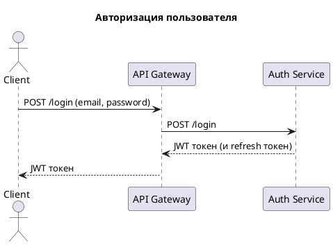
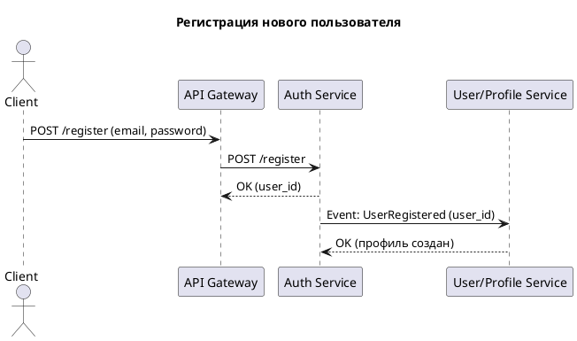
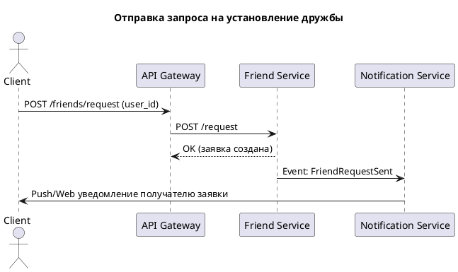
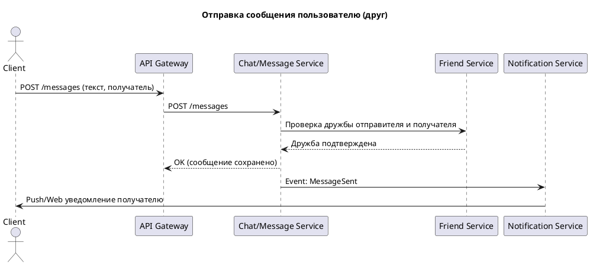
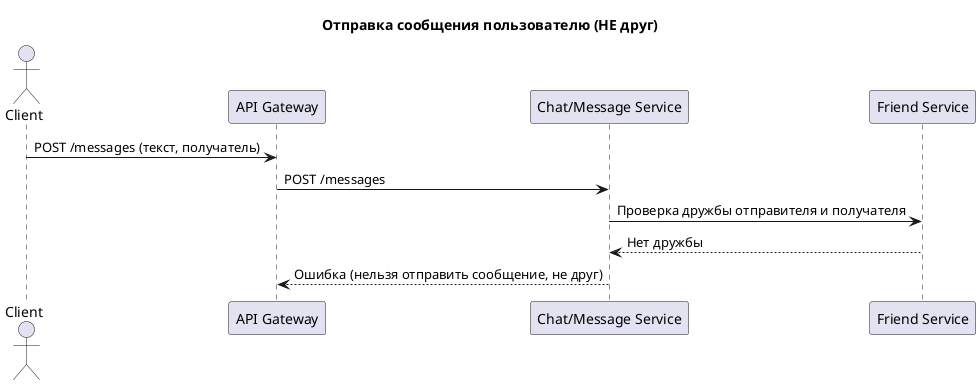

### Авторизация пользователя

### Регистрация нового пользователя

### Отправка запроса на установление дружбы

### Отправка сообщения пользователю (друг)

### Отправка сообщения пользователю (НЕ друг)

